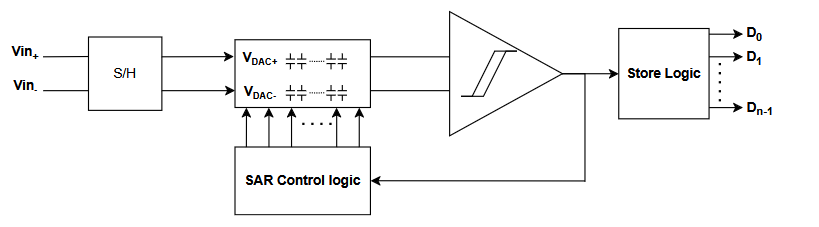

# Introduction to SAR ADCs

Successive Approximation Register (SAR) Analog-to-Digital Converters (ADCs) are a type of Nyquist-rate ADC known for their excellent balance between **resolution, power efficiency, and area**. Unlike flash or integrating ADCs, SAR ADCs determine the digital output using a **sequential binary search algorithm**, making them well suited for **moderate-speed and low-power applications**, particularly in deep submicron CMOS technologies where digital circuits scale efficiently.

A SAR ADC typically consists of three main components: a **comparator**, a **capacitive DAC (C-DAC)**, and **SAR control logic**. These blocks operate together to iteratively approximate the input voltage during the conversion process.

Below is a simplified block diagram of a differential SAR ADC architecture:

<p align="center">
 
</p>


A commonly used technique in SAR ADCs is **charge redistribution in the capacitive DAC**. Conventional switching schemes can lead to significant energy consumption due to repeated charging and discharging of capacitors. To improve efficiency, **monotonic switching schemes** are often adopted. These approaches allow direct sampling on the top plates, reducing the total capacitance and significantly lowering switching energy—sometimes to as little as **18.7% of the energy required by conventional methods**.

However, top-plate sampling can introduce **common-mode variation at the comparator input**, which may affect linearity due to input-referred offset. This trade-off must therefore be carefully considered in practical SAR ADC designs.

This repository demonstrates the **design workflow of a SAR ADC implemented using open-source EDA tools**, targeting the **IHP SG13G2 technology node**. The project covers schematic design, digital verification, layout development, and system-level simulation within a mixed-signal IC design flow.

---

## 🚀 Overview

The project presents a practical implementation of a **Successive Approximation Register (SAR) Analog-to-Digital Converter** using open-source design tools.

Both **analog and digital circuit blocks** are included, illustrating how a mixed-signal system can be developed and integrated into a complete ADC.

### Project goals

- Practice **full-custom mixed-signal circuit design**
- Develop circuits using a **hierarchical block-based methodology**
- Integrate **analog and digital components**
- Perform verification using **open-source EDA tools**
- Demonstrate a **reproducible open-source IC design workflow**

## 🧱 Architecture

The main building blocks of the SAR ADC include:

Dynamic Comparator

Capacitive DAC (C-DAC)

SAR Digital Logic

Bootstrap Switch

Switch Array

Mixed-signal integration

The design follows a bottom-up hierarchical methodology, where each block is designed and verified individually before being integrated into the complete system.

---

## 📂 Repository Structure

```bash
SAR_ADC_8BIT_IHP/
├── README.md
│
├── docs
│   ├── comparator.md
│   ├── digital_comps.md
│   └── sar_adc.md
│
├── gds
│   ├── C-DAC.gds
│   ├── Cunit.gds
│   ├── DIFF_COMPARATOR.gds
│   ├── T_gate.gds
│   ├── T_gate_switch.gds
│   ├── bootstrap_switch.gds
│   ├── inverter.gds
│   ├── nand_gate.gds
│   ├── sar_logic.gds
│   └── switch_array.gds
│
├── rtl
│   └── verilog
│       ├── Makefile
│       ├── conf.gtkw
│       ├── sar_logic.v
│       └── sar_logic_tb.v
│
├── scripts
│   └── python
│       └── generate_sym.py
│
└── xschem
    ├── SAR_ADC.sch
    ├── SAR_ADC_tb.sch
    ├── dynamic_comparator.sch
    ├── C-DAC.sch
    ├── switch_array.sch
    ├── bootstrap_switch.sch
    ├── nand_gate.sch
    ├── inverter.sch
    ├── T_gate.sch
    └── simulations
  ```


## ▶️ Run the Simulation

This project can be reproduced using open-source analog tools on Linux or WSL.

## Clone the Repository
git clone https://github.com/tienakai/SAR_ADC_8BIT_IHP.git

cd SAR_ADC_8BIT_IHP
## Run Xschem (GUI)

Example: run SAR ADC testbench simulation
```bash
cd xschem
xschem SAR_ADC_tb.sch
```

Inside Xschem:

- Click Netlist

- Click Simulate

## Digital Simulation

Run SAR logic simulation:
```bash
cd rtl/verilog
make full
```
Waveforms can be viewed using GTKWave.


## 🧠 Layout and GDS

All layout data is located in:

```bash
gds/
```


Integration status

- Individual modules have passed DRC and LVS verification.

-  Current work focuses on top-level layout integration, including module interconnection and pad ring connectivity.

Layouts can be viewed using:

Magic

KLayout

| Module | Description | DRC | LVS |
|------|-------------|------|------|
| Comparator | Dynamic comparator layout | ✅ | ✅ |
| Capacitive DAC | Capacitor DAC array | ✅ | ✅ |
| SAR Logic | Digital SAR control logic | ✅ | ✅ |
| Bootstrap Switch | Sampling switch | ✅ | ✅ |
| Switch Array | DAC switching network | ✅ | ✅ |
| Basic Digital Gates | Inverter, NAND | ✅ | ✅ |


